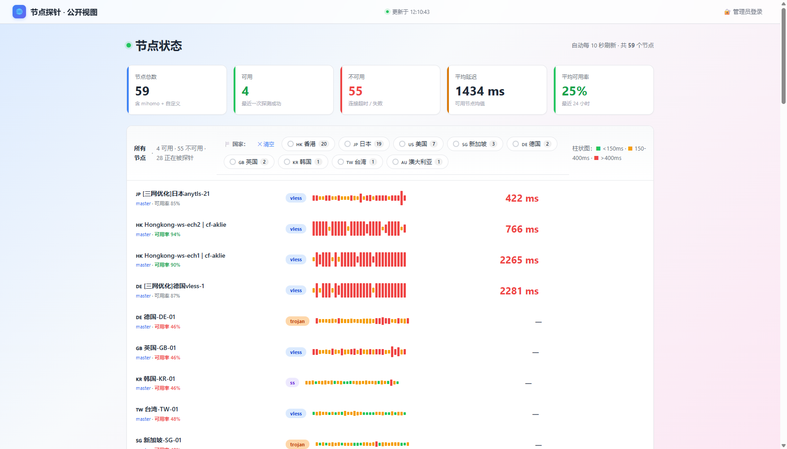
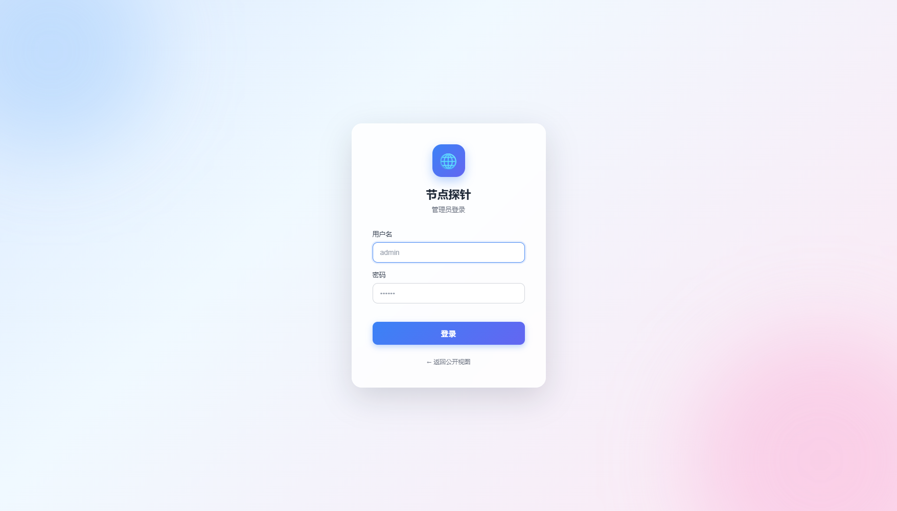
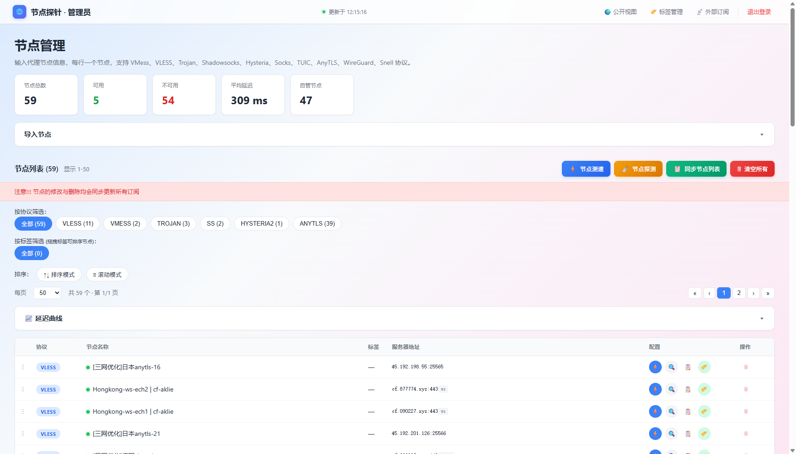
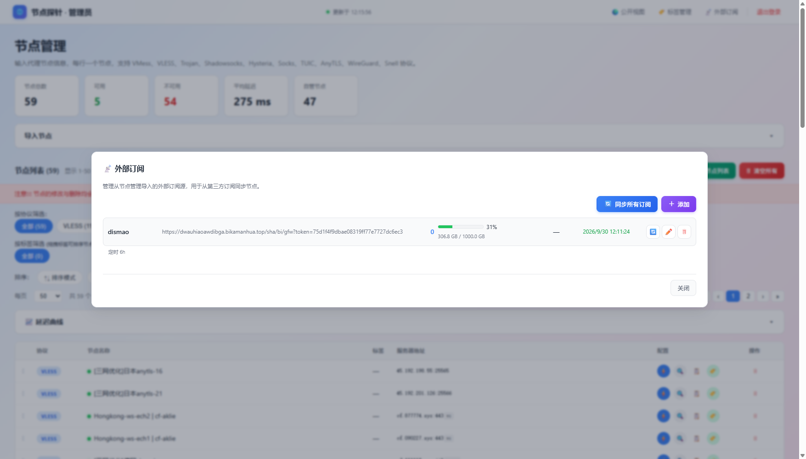

# 🌐 节点探针 Dashboard

[](https://www.python.org)
[](https://fastapi.tiangolo.com)
[](LICENSE)
[](docker-compose.yml)

基于 [daitcl/mihomo](https://github.com/daitcl/mihomo) 暴露的 Clash External Controller API，做的**节点稳定性持续探测 + 历史聚合 + 浅色主题 Web Dashboard**。

支持 mihomo 节点 + 自定义节点混合管理，**多源外部订阅自动同步**（含流量信息 + GeoIP 节点国家识别），5min/1h 聚合历史数据用于绘制延迟曲线。

---

## ✨ 特性

- ⚡ **持续轮询**：每 60s 调用 `/proxies/:name/delay` 探测所有节点
- 📊 **历史曲线**：7 天内原始点 / 5 分钟聚合；7-30 天 1 小时聚合（永久保留）
- 🌍 **多源外部订阅**：每条订阅可独立设置同步间隔（每 N 分钟 / 每天 HH:MM / 每周 D HH:MM / 仅手动）
- 📊 **流量统计**：自动解析 `subscription-userinfo` header → 进度条 + 到期
- 🚩 **国旗自动识别**：启发式（节点名关键字） + GeoIP（ip-api.com 在线查询）双层 fallback
- 🏷️ **标签系统**：多对多关系，节点可打多个标签，按标签筛选
- 🧪 **连通性测试**：TCPing / TLS / 真实延迟三种方式
- 🔐 **鉴权**：JWT + bcrypt + 登录限速（5/min/IP）+ 主动撤销（黑名单）
- 🛡️ **SSRF 防护**：订阅同步拒绝私网/loopback/云 metadata 地址
- 🌗 **浅色主题 UI**：玻璃态顶部、彩色按钮组、响应式布局

---

## 📷 截图

### 公开页（无需登录）— 节点状态 + 延迟柱状图 + 国家筛选 + 可用率：



### 管理员登录页（独立 /admin/login）：



### 管理后台（需登录）— 节点管理 + 浅色主题：



### 外部订阅管理 — 流量统计 + 节点同步 + 定时模式：



---

## 🚀 快速开始

### 方式一：Docker Compose（推荐）

```bash
git clone https://github.com/lei33440/mihomo-probe-dashboard.git
cd mihomo-probe-dashboard
cp .env.example .env
# 编辑 .env，至少改 JWT_SECRET 和 ADMIN_PASSWORD
nano .env
docker compose up -d
```

打开 `http://localhost:19001/` 看公开页，`http://localhost:19001/admin/login` 登录。

### 方式二：本地 Python（开发用）

需要 **Python 3.11+**

```bash
git clone https://github.com/lei33440/mihomo-probe-dashboard.git
cd mihomo-probe-dashboard
cp .env.example .env

# 创建虚拟环境
cd backend
python -m venv .venv
# Windows:
.venv\Scripts\activate
# Linux/macOS:
source .venv/bin/activate

pip install -r requirements.txt

# 启动
python -m uvicorn app.main:app --host 0.0.0.0 --port 19001 --reload
```

打开 `http://localhost:19001/`。

### 接入已有 mihomo

本项目**不直接运行 mihomo**，而是作为**外部控制器**的客户端访问它。

修改 `.env`：
```bash
# mihomo 在同一 docker 网络
MIHOMO_API_URL=http://mihomo:9090
MIHOMO_SECRET=你的mihomo的external-controller-secret
```

mihomo 端需要开启 External Controller（在 `config.yaml`）：
```yaml
external-controller: 0.0.0.0:9090
secret: '你的mihomo的external-controller-secret'
```

如果没有 mihomo（只想体验 UI），把 `.env` 改成 `DEMO_MODE=true`，会自动注入 12 个 mock 节点。

---

## ⚙️ 配置

完整配置见 `.env.example`：

| 变量 | 默认 | 说明 |
|---|---|---|
| `MIHOMO_API_URL` | `http://mihomo:9090` | mihomo API 地址 |
| `MIHOMO_SECRET` | `""` | mihomo external-controller secret |
| `PROBE_INTERVAL` | `60` | 探测周期（秒） |
| `PROBE_TIMEOUT` | `5000` | 单次探测超时（毫秒） |
| `PROBE_URL` | `https://www.gstatic.com/generate_204` | 探测目标 URL |
| `ADMIN_USERNAME` | `admin` | 初始管理员账号 |
| `ADMIN_PASSWORD` | `changeme` | 初始管理员密码（首次启动后请改） |
| `JWT_SECRET` | 32字节随机 | **必须修改**，否则无法启动鉴权 |
| `JWT_EXPIRES_HOURS` | `24` | token 有效期 |
| `CORS_ORIGINS` | `""` | 跨域白名单（生产必填，逗号分隔） |
| `DEMO_MODE` | `false` | 无 mihomo 时开启，会注入假节点 |

---

## 📖 使用说明

### 公开页 `http://localhost:19001/`

- 5 个统计卡片：节点总数 / 可用 / 不可用 / 平均延迟 / 平均可用率
- 节点状态列表：每行显示
  - **国旗**（自动识别）
  - **节点名** + 探测来源（master / 自定义）+ 24h 可用率
  - **协议 chip**（vless / vmess / trojan / anytls / ss / hysteria2）
  - **延迟柱状图**（最近 30 次探测，绿<150ms / 橙150-400ms / 红>400ms）
  - **当前延迟**
- **国家多选筛选**：可勾选多个国家组合筛选

### 管理后台 `http://localhost:19001/admin/login`

- 节点测速 / 节点探测 / 同步节点列表 / 清空所有 4 个主操作
- 节点管理：按协议 / 标签筛选；TCPing 测试 / 延迟探测 / 复制 / 打标签 / 删除
- 标签管理：创建/编辑/删除全局标签
- 外部订阅：CRUD + 立即同步 + 定时同步 + 预览 + 流量统计

---

## 🛠️ 架构

```
┌─────────────────┐    GET /proxies/:name/delay    ┌─────────────────┐
│   Scheduler      │ ────────────────────────────▶ │   Mihomo         │
│  (APScheduler)   │ ◀────────────────────────────  │   :9090          │
└────────┬────────┘                                └─────────────────┘
         │ probes
         ▼
┌─────────────────┐
│   SQLite         │   原始 7d │ 5min 30d │ 1h 永久
└────────┬────────┘
         │
         ▼
┌─────────────────┐
│   FastAPI        │  /api/public/*      公开
│                  │  /api/admin/*       鉴权 + 完整
│                  │  /static/index.html  公开页
│                  │  /static/admin.html  管理员
│                  │  /static/login.html  登录
└─────────────────┘
```

外部订阅同步：cron / 间隔 / 手动触发 → HTTP 抓取 → 解析 URI / yaml → 启发式/GeoIP 识别国家 → 入库。

---

## 🔐 安全说明

- **JWT 必改**：`JWT_SECRET` 启动时若仍为默认值会告警
- **登录限速**：5 次/分钟/IP（滑动窗口）
- **JWT 撤销**：登出后 jti 入黑名单，旧 token 立即失效
- **SSRF 防护**：订阅同步拒绝 `127.0.0.0/8`、`10.0.0.0/8`、`172.16.0.0/12`、`192.168.0.0/16`、`169.254.0.0/16`、IPv6 私网
- **CORS 白名单**：生产环境务必配置 `CORS_ORIGINS=https://your.domain.com`

---

## 📋 目录结构

```
mihomo-probe-dashboard/
├── .env.example
├── .gitignore
├── README.md
├── CHANGELOG.md
├── LICENSE
├── docker-compose.yml
├── backend/
│   ├── Dockerfile
│   ├── requirements.txt
│   └── app/
│       ├── main.py              # FastAPI 入口 + lifespan
│       ├── config.py            # pydantic-settings
│       ├── database.py          # SQLite + 自动迁移
│       ├── auth.py              # bcrypt + JWT
│       ├── dependencies.py      # require_admin 鉴权
│       ├── mihomo_client.py     # 调 mihomo /proxies
│       ├── parser.py            # URI / YAML 解析
│       ├── probe_custom.py      # TCPing
│       ├── geoip.py             # 在线 IP 归属查询
│       ├── scheduler.py          # APScheduler
│       ├── repository.py        # SQLite CRUD
│       ├── aggregagor.py        # 5min/1h 聚合
│       └── routers/
│           ├── auth.py           # 登录/登出
│           ├── public.py         # 公开 API
│           ├── admin.py          # 管理 API
│           ├── custom_proxies.py # 自定义节点
│           ├── external_subs.py  # 外部订阅
│           └── tags.py           # 标签
└── data/                         # SQLite 文件（.gitignore）
```

---

## 🐛 故障排查

| 现象 | 解决 |
|---|---|
| 公开页节点为空 | 检查 `MIHOMO_API_URL` 是否正确；或开 `DEMO_MODE=true` |
| 节点同步失败 | mihomo 是否开启 `external-controller`；secret 是否一致 |
| 登录后 token 401 | `JWT_SECRET` 改过导致旧 token 失效，重新登录 |
| 外部订阅预览 400 | URL 指向了内网，被 SSRF 防护拦截 |
| GeoIP 没生效 | 服务能否访问 `ip-api.com`；首次启动调度器会查一次 |

---

## 📜 许可

[MIT](LICENSE)

## 🙏 致谢

- [daitcl/mihomo](https://github.com/daitcl/mihomo) — mihomo 镜像
- [MetaCubeX/mihomo](https://github.com/MetaCubeX/mihomo) — Clash Meta 核心
- [MetaCubeX/metacubexd](https://github.com/MetaCubeX/metacubexd) — UI 设计参考
- [FastAPI](https://fastapi.tiangolo.com) — 后端框架
- [ECharts](https://echarts.apache.org) — 图表
